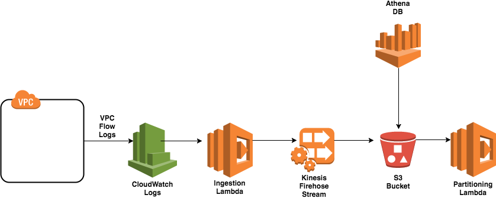

# AWS VPC Flow Log Analysis Tool
A Terraform module to deploy and configure a serverless VPC Flow Logs analysis tool.
It utilises CloudWatch Logs, S3, Lambda, Kinesis Firehose and Athena. The data is partitioned
and compressed to save on Athena costs. In general this setup can save up to 50% of costs
when compared to a traditional VPC Flow Logs + ELK setup. It follows the suggested solution
in the AWS blog article [Analyzing VPC Flow Logs with Amazon Kinesis Firehose, Amazon Athena, and Amazon QuickSight](https://aws.amazon.com/blogs/big-data/analyzing-vpc-flow-logs-with-amazon-kinesis-firehose-amazon-athena-and-amazon-quicksight/).
and utilises the partitioning lambda located [here](https://github.com/bsnively/aws-big-data-blog/tree/master/aws-blog-vpcflowlogs-athena-quicksight/PartitioningFunction)
However, this module has been extended by making the ingestion lambda include transforming of the flow log to add the relative NACL ID and Security Group IDs for the ENI of a given log entry.

## Requirements
* Terraform v0.11.2 or higher

## Components
- `CloudwatchLog Groups` - The log group containing the log streams from the deployed flow log.
- `S3 Bucket` - The bucket to store the flow log data that Athena will query.
- `Kinesis Firehose` - The Firehose stream that ingests the data from the Ingestion Lambda Function and GZIPs the data on the S3 bucket.
- `Ingestion Lambda` - The Lambda Function processes the VPC Flow Log CloudWatchLog Group and passes that transformed data to Kinesis Firehose.
- `Partitioning Lambda` - The Lambda Function that creates the Athena table partition based on (Month, Day, Hour).
- `Athena DB` - The Athena DB that can be queried via ad-hoc and named queries.



## Module Inputs
You have to supply the respective variable (`flVpcId`, `flSubnetId`, `flEniId`) when you select the VPC deployment type `flFootPrint` (`vpc`,`subnet` or `eni`).

- `region` - The Region to deploy the VPC Flow Log and the analysis resources. (Required)
- `flLogGroupName` - The name of the VPC Flow Log Group. (Optional, default = `dp_flow_logs_log_group`)
- `flTrafficType` - The VPC Flow Log traffic type. Must be either `ALL`, `ACCEPT` or `REJECT`. (Optional, default = `ALL` )
- `flVpcId` - The VPC ID to deploy the VPC Flow Logs for.(Optional)
- `flSubnetId` - The Subnet ID to deploy the VPC Flow Logs for. (Optional)
- `flEniId` - The ENI ID to deploy the VPC Flow Logs for. (Optional)
- `flFootPrint` - The foot print the Flow logs applies to. Should be either `vpc`, `subnet` or `eni` (Required, default = `vpc`)
- `flS3Bucket` - The name of the S3 bucket for Athena DB. (Optional, default = `dp-flow-log-bucket`)
- `flAthenaDbName` - The name of the Athena DB. (Optional, default = `dp_flow_log_athena_db`)
- `flAthenaDbTableName` - The name of the Athena Table. (Optional, default = `vpc_flow_logs`)
- `flAthenaDbTableQueryName` - The name of the Athena Table creation query. (Optional, default = `dp_flow_log_table_query`)
- `flAthenaDbPartTableQueryName` - The name of the Athena Partitioned Table creation query. (Optional, default = `dp_flow_log_part_table_query`)
- `flAthenaDbTop25RejectsQueryName` - The name of a sample Athena named query that outputs the top 25 rejected packets. (Optional, default = `dp_flow_log_top_25_rejects_query`)
- `flAthenaDbTCPRejectsQueryName` - The name of a sample Athena named query that outputs all the TCP rejected packets. (Optional, default = `dp_flow_log_tcp_rejected_connections_query`)
- `flAthenaDbHTTPSRequestsQueryName` - The name of a sample Athena named query that outputs the highest HTTPs requests. (Optional, default = `dp_flow_log_highest_https_requests_query`)
- `flathenaPartType` - Select whether to partiton data based on `Month`, `Day` or `Hour`. (Optional, default = `Day`)
- `flTags` - A map of resource tags. (Required)

## Usage
``` js
module "test_vpc_analysis" {
    source = "git::ssh://git@shaka/Automation/tf-vpc-flow-analysis?ref=1.0"
    region = "eu-west-1"
    flTags = { Name = "test_vpc_analysis", Environment = "UAT", Automation = "created by terraform" }
    flVpcId = "vpc-3adf0153"
    flathenaPartType = "Hour"
}

```
## Module Outputs
